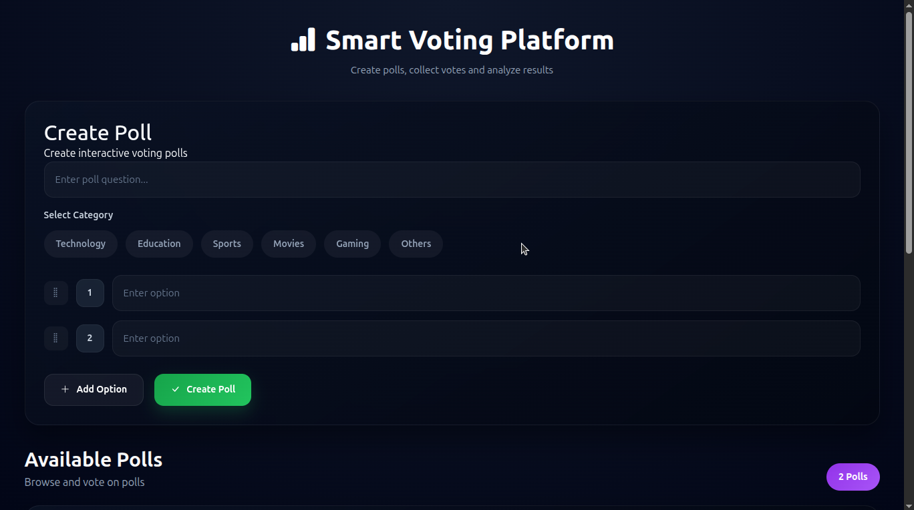
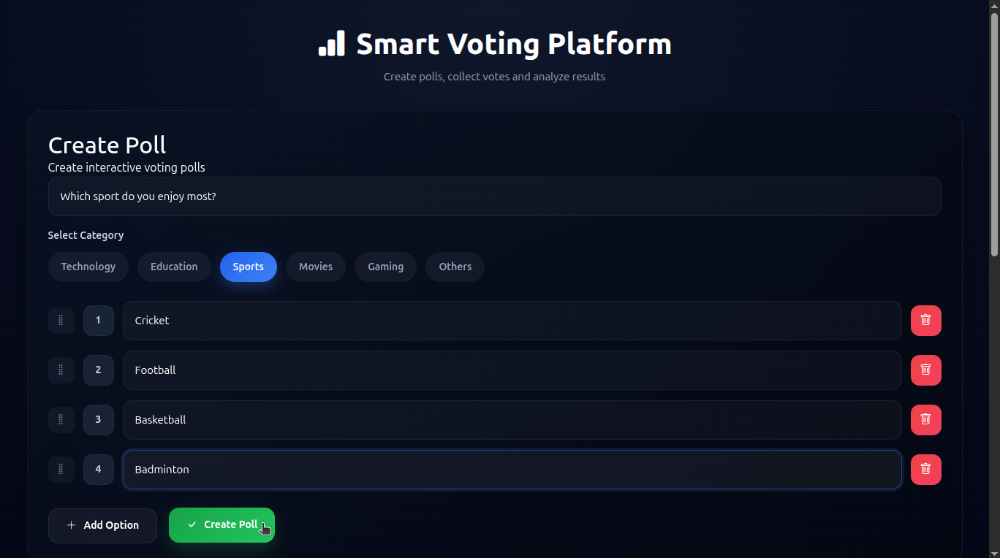
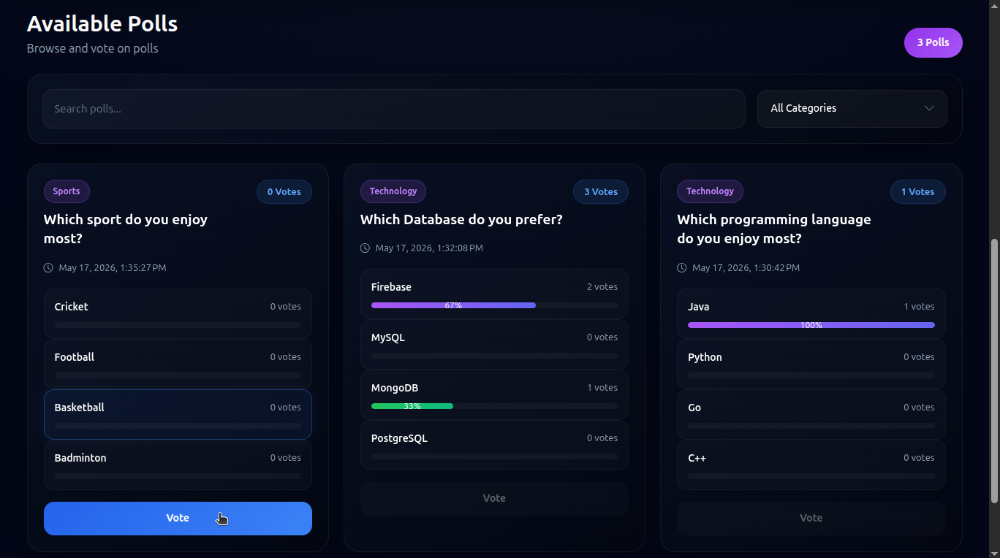
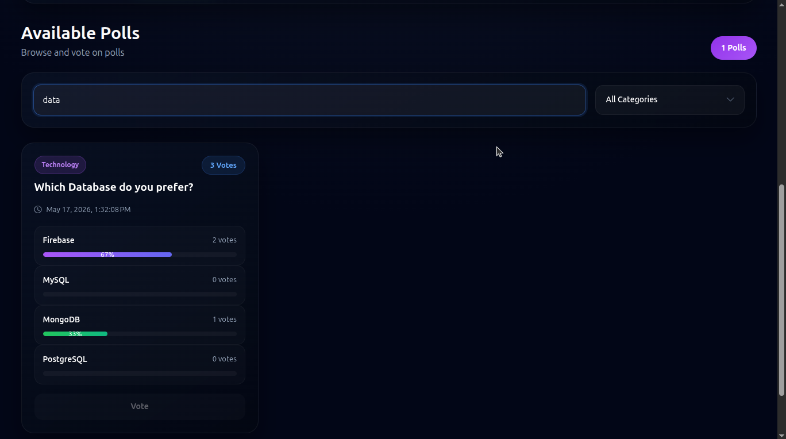
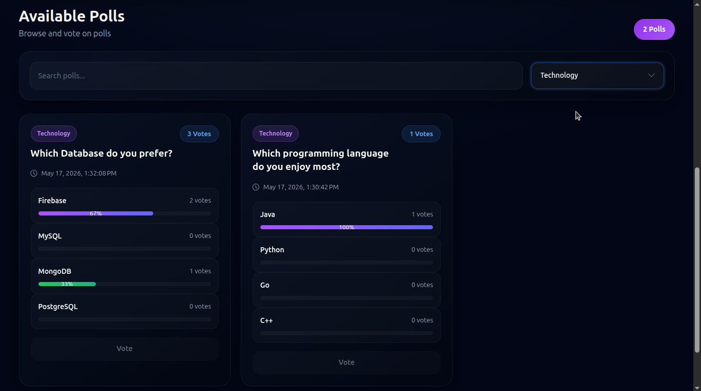
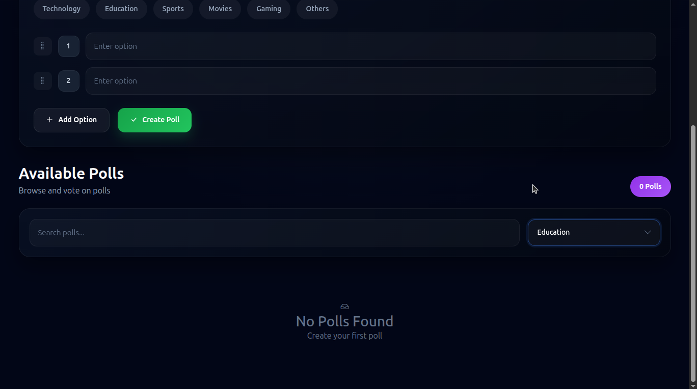
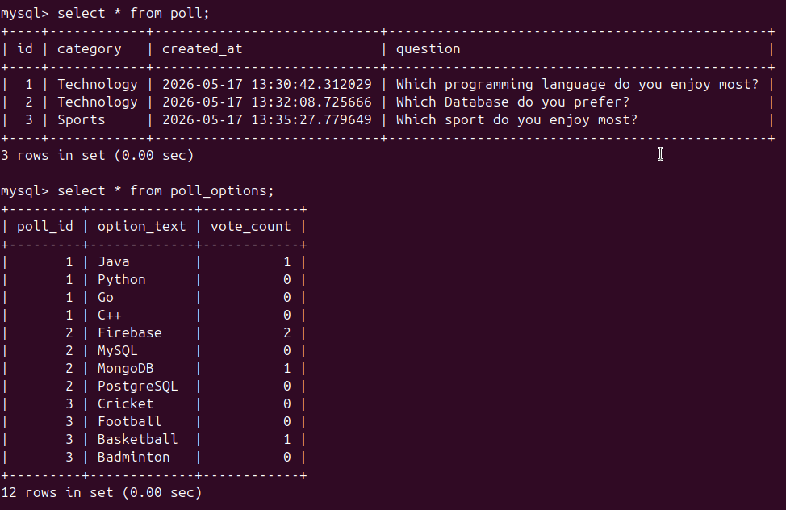

# Smart Voting Platform

A modern full-stack voting application built using Angular, Spring Boot, and MySQL.

This project allows users to create polls, vote instantly, filter polls by categories, search polls, and view live vote statistics with a modern responsive UI.

---

# Features

* Create Interactive Polls
* Vote Instantly
* Search Polls
* Category Filtering
* Drag & Drop Poll Options
* Vote Percentage Progress Bars
* Responsive Modern UI
* Pagination
* Toast Notifications
* MySQL Database Integration
* REST API Backend
* Real-Time UI Updates

---

# Tech Stack

| Technology | Purpose |
|---|---|
| Angular 20 | Frontend Framework |
| TypeScript | Frontend Language |
| Spring Boot | Backend Framework |
| Spring MVC | REST APIs |
| Spring Data JPA | Database Operations |
| Hibernate | ORM Framework |
| MySQL | Database |
| Angular CDK | Drag & Drop |
| ngx-toastr | Notifications |
| Bootstrap Icons | Icons |
| Maven | Backend Dependency Management |

---

# Project Structure

```text
Vote-App
│
├── backend
│
├── frontend
│
├── screenshots
│
├── README.md
│
└── .gitignore
```

---

# Screenshots

## Homepage



---

## Create Poll



---

## Vote Submission



---

## Search Poll



---

## Category Filtering



---

## No Polls Found



---

## Database



---

# Backend Setup

```bash
cd backend
mvn spring-boot:run
```

Backend runs on:

```text
http://localhost:8080
```

---

# Frontend Setup

```bash
cd frontend
npm install
ng serve
```

Frontend runs on:

```text
http://localhost:4200
```

---

# Future Improvements

* JWT Authentication
* Prevent Duplicate Voting
* WebSocket Live Updates
* Docker Deployment
* Poll Analytics Dashboard
* Dark/Light Theme
* User Accounts

---

# Author

AMARAVADI SANJAY

---

# License

This project is for learning and portfolio purposes.